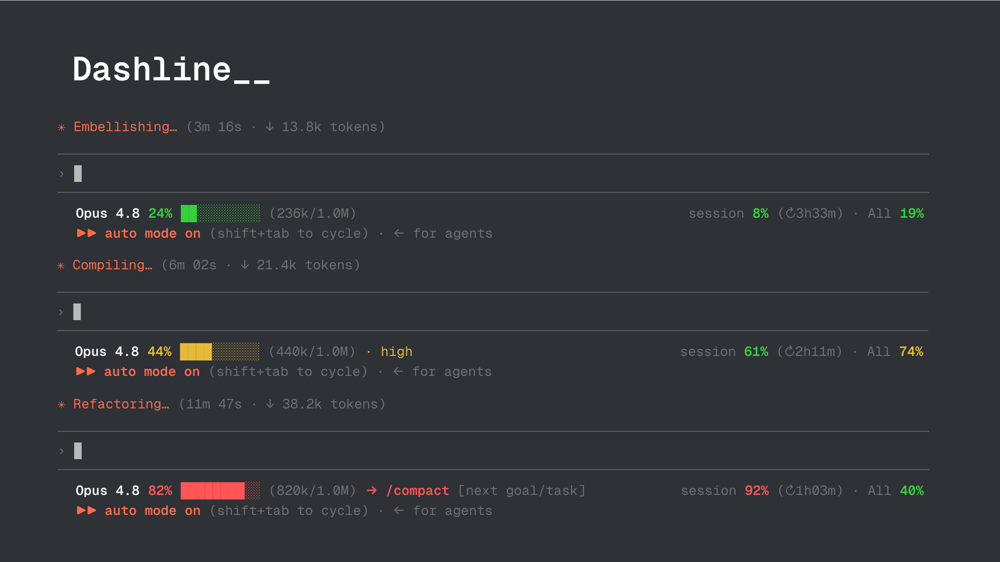

# dashline

A configurable Claude Code status line. You compose it in `settings.json` by
listing the fields you want and where they go. No scripting, no bash. It ships with
a sensible default (context window on the left, subscription usage on the right), so
it looks right the moment you install it.



<p align="center">
  <a href="https://x.com/_ordinarynerds"></a>
</p>

## Why

If you want something simpler than a full status-line builder, this is it. Two
things go wrong in a long Claude Code session: the context window fills up until the
model starts dropping detail, and you hit a rate limit you never saw coming. dashline
puts both in front of you, and lets you add anything else the payload knows about by
naming it in your settings.

## Install

A Claude Code plugin can't set the main status line on its own, so either route ends
with `settings.json` pointing at dashline. The plugin route runs that step for you.

### As a plugin (recommended)

```
/plugin marketplace add ordinarynerds/dashline
/plugin install dashline@ordinarynerds
/dashline:install
```

### Manual

```bash
git clone https://github.com/ordinarynerds/dashline.git ~/.claude/dashline
cd ~/.claude/dashline && npm install && npm run build
./scripts/install.sh
```

The installer backs up `settings.json`, points `statusLine` at
`node dist/dashline.js`, and leaves a `settings.json.bak-dashline-*` file. Undo with
`./scripts/install.sh --uninstall`. Start a new session or run `/statusline` to see it.

**Requirements:** Node 18 or newer. That is the only dependency.

## Configure

Everything lives under a `dashline` key in `~/.claude/settings.json` (project
`.claude/settings.json` and `settings.local.json` override it). This is the default,
and writing it out reproduces what ships:

```jsonc
{
  "dashline": {
    "lines": [
      { "left": ["branch", "model", "context"], "right": ["session", "weekly"] }
    ]
  }
}
```

`lines` is a list, and each entry is one row on screen.

**A row** is either a bare array, which is left-aligned:

```jsonc
["branch", "model", "context"]
```

or an object with up to three zones that dashline spreads across the width:

```jsonc
{ "left": ["branch"], "center": ["cwd"], "right": ["cost", "pr"] }
```

**An item** in a zone is one of:

| Form | Meaning |
|---|---|
| `"branch"` | a widget, in its default style |
| `["model", "red"]` | a widget, recolored (see [styles](#styles)) |
| `["context", "bar"]` | a widget, in a named variant (see [widgets](#widgets)) |
| `["context", { "variant": "bar", "color": "yellow" }]` | variant and color together |
| `"codemap ls --linked"` | anything unrecognized runs as a shell command; its first line of output is shown |

A string is read as a color when it is a known style term, otherwise as a variant, so
`["model", "red"]` and `["context", "pct"]` both do what they look like.

### Other keys

| Key | Default | Effect |
|---|---|---|
| `separator` | `·` | drawn dim between items in a zone |
| `margin` | `5` | columns kept free at the right edge |
| `warn` | `40` | context turns yellow ("high") at/above this % |
| `compact` | `50` | context turns red with `→ /compact` at/above this % |
| `usageWarn` | `70` | usage widgets turn yellow at/above this % |
| `usageCrit` | `90` | usage widgets turn red at/above this % |

## Widgets

Every widget reads one part of the JSON payload Claude Code sends on stdin. A widget
with no data to show removes itself, and a row with nothing left on it is skipped.

| Widget | Shows | From | Default style | Variants |
|---|---|---|---|---|
| `branch` | git branch (`⎇ main`) | git | cyan | |
| `model` | model name | `model.display_name` | bold | |
| `context` | percent, bar, tokens, `/compact` nudge | `context_window` | green / yellow / red by fill | `full`, `bar`, `pct`, `tokens` |
| `session` | 5-hour usage percent and reset countdown | `rate_limits.five_hour` | green / yellow / red | |
| `weekly` | 7-day usage percent | `rate_limits.seven_day` | green / yellow / red | |
| `cost` | session cost in USD | `cost.total_cost_usd` | green | |
| `pr` | open PR number (`PR #702`) | `pr.number` | magenta | |
| `worktree` | linked worktree name (`⌂ hotfix`) | `workspace.git_worktree` or git | yellow | |
| `cwd` | working directory, `~` collapsed | `workspace.current_dir` | dim | `full`, `basename` |
| `name` | session name | `session_name` | dim | |
| `output` | output style (`/rc`) | `output_style.name` | dim | |
| `effort` | reasoning effort | `effort.level` | dim | |

The usage widgets (`session`, `weekly`) appear on Pro and Max accounts after the first
response of a session, when the payload starts carrying rate limits.

## Styles

A style term is one or more of these words, so `"bold red"` is valid:

`red` · `green` · `yellow` · `blue` · `magenta` · `cyan` · `gray` · `dim` · `bold`

Recoloring an item replaces its whole look with that color. The color-by-fill widgets
(`context`, `session`, `weekly`) lose their meaning when you recolor them, so leave
those alone unless you want a fixed color.

## Examples

Two lines, a custom left/right split, and a plain directory row:

```jsonc
{
  "dashline": {
    "lines": [
      { "left": ["model", "name"], "right": ["output"] },
      { "left": ["branch", ["context", "pct"]], "right": ["cost", "pr"] },
      ["cwd"]
    ]
  }
}
```

Fold in your own tools as command rows. Each command is given the same JSON on stdin,
plus `DASHLINE_BRANCH`, `DASHLINE_WORKTREE`, and `DASHLINE_CWD` in its environment:

```jsonc
{
  "dashline": {
    "lines": [
      { "left": ["branch", "context"], "right": ["session", "weekly"] },
      ["codemap ls --linked"],
      ["kache stat --branch \"$DASHLINE_BRANCH\""]
    ]
  }
}
```

## How it works

Claude Code hands the status-line command a JSON payload on stdin. dashline reads it,
reads your `dashline` config from the settings files, and prints one line per entry in
`lines`. No network, no transcript parsing, nothing that drifts between releases.

Each widget is a small pure function from the payload to a string. The git branch and
worktree are the one thing not in the payload, so dashline asks `git` once. A command
item runs in a 2-second timeout, so a slow tool can't stall the line.

## Security

dashline can run shell commands, so it is deliberate about where they come from.

- Command items run only from your own user settings (`~/.claude/settings.json` and
  `~/.claude/settings.local.json`). Config that arrives through a project, such as a
  `.claude/settings.json` committed to a repository you cloned, may arrange widgets, but
  any command in it is dropped. Cloning a repo cannot make dashline run code.
- Dynamic values reach your commands through the environment (`$DASHLINE_BRANCH`,
  `$DASHLINE_WORKTREE`, `$DASHLINE_CWD`), never spliced into the command text, so a
  branch named like a shell expression cannot inject anything.
- dashline's own git lookups run without a shell.
- Each command runs under a 2-second timeout.
- A command's output is printed as is, including any terminal escapes it emits, so wire
  up only tools you trust.

## Develop

```bash
npm install
npm test          # node's test runner over src
npm run build     # bundle src to dist/dashline.js
npm run typecheck
```

Source is in `src/`: `widgets/` holds one file per field, `render.ts` lays out the
zones, `layout.ts` justifies a line, `config.ts` reads and merges settings. Adding a
widget is one file plus one line in `widgets/registry.ts`.

## License

MIT © Ordinary Nerds. See [LICENSE](LICENSE).
