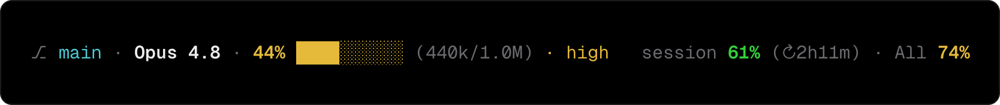
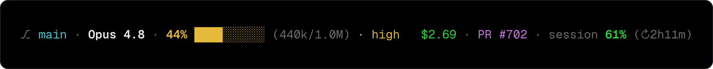
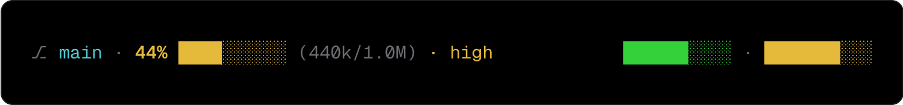
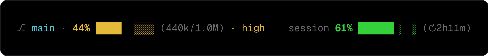
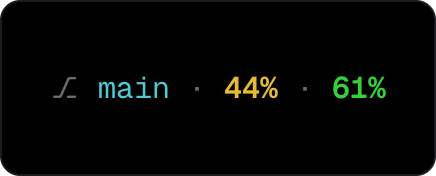
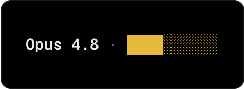
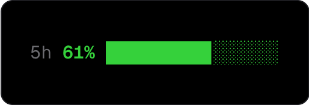
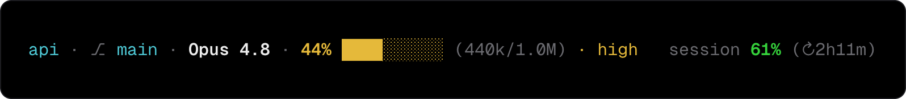
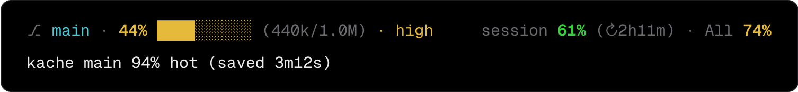

# dashline recipes

Each recipe is one value for `dashline.lines` and the status line it renders. Copy a
block into `~/.claude/settings.json`. The [reference](README.md#reference) lists every
widget and option.

## Default

The context window on the left, plan usage on the right.



```json
{ "left": ["branch", "model", "context"], "right": ["session", "weekly"] }
```

## Cost and PR on the right



```json
{ "left": ["branch", "model", "context"], "right": ["cost", "pr", "session"] }
```

## Usage as bars

The `bar` variant on any percent widget draws only the meter.



```json
{ "left": ["branch", "context"], "right": [["session", "bar"], ["weekly", "bar"]] }
```

## Smooth sub-cell bars

The `fine` bar style steps in eighths of a cell for a smoother edge.



```json
{ "left": ["branch", ["context", { "bar": "fine" }]], "right": [["session", { "bar": "fine" }]] }
```

## Numbers only

The `pct` variant drops the bar and keeps the percentage.



```json
["branch", ["context", "pct"], ["session", "pct"]]
```

## Minimal

A bare array is one left-aligned row.



```json
["model", ["context", "bar"]]
```

## Three zones

`left`, `center`, and `right` spread across the width.


```json
{ "left": ["branch", "model"], "center": ["context"], "right": ["session", "weekly"] }
```

## Rename and trim a widget

Options rename the label, drop the countdown, set the bar style, and set the width.



```json
{ "left": [["session", { "label": "5h", "countdown": false, "bar": "fine", "width": 16 }]] }
```

## A literal text tag

A `{ "text": ... }` item prints as is, with an optional color.



```json
{ "left": [{ "text": "api", "color": "cyan" }, "branch", "model", "context"], "right": ["session"] }
```

## Your own tool on its own row

This is a full two-row `lines` array. The second row is a command; dashline runs it with
the payload on stdin plus `$DASHLINE_BRANCH`, `$DASHLINE_WORKTREE`, and `$DASHLINE_CWD`,
then prints its first line. Command rows run only from your own settings (see
[Security](README.md#security)).



```json
[
  { "left": ["branch", "context"], "right": ["session", "weekly"] },
  ["kache stat --branch \"$DASHLINE_BRANCH\""]
]
```
